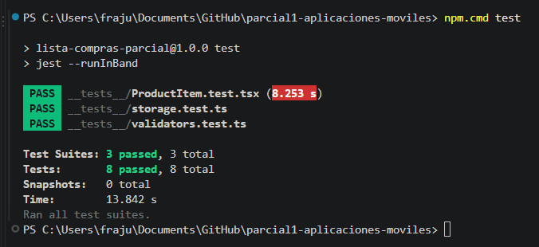

# Mi lista de compras — Parcial 1 de Aplicaciones Móviles

**Alumno:** Franco Julián Barrera · **Opción elegida:** Lista de compras inteligente.

Aplicación móvil realizada con React Native, Expo y TypeScript. Permite organizar una lista de compras por usuario, guardar productos en el dispositivo y programar un recordatorio local.

## Ejecución

Requiere Node.js LTS y Expo Go compatible con SDK 57 en un teléfono. Desde la carpeta del proyecto:

```bash
npm install
npm start
```

Con el teléfono y la computadora en la misma red, escanear el QR desde la cámara de iOS o desde Expo Go en Android. Si la conexión de red local no está disponible, ejecutar `npx expo start --tunnel` y aceptar la instalación del paquete del túnel si se solicita. Expo Go puede solicitar una cuenta de Expo.

## Funcionalidades implementadas

- Cuatro pantallas con React Navigation y Native Stack: Login, Registro, Home y Alta de producto.
- Registro local con usuario y contraseña, confirmación de contraseña y control de usuarios duplicados.
- Login que valida las credenciales registradas. Las pantallas privadas solo se montan después de iniciar sesión.
- Cierre de sesión. Al reiniciar la aplicación se solicita un nuevo login; los usuarios y productos permanecen guardados.
- Alta de productos con nombre y cantidad, listado, marcado como comprado y eliminación con confirmación.
- Persistencia con AsyncStorage y listas independientes para cada usuario.
- Notificación local mediante expo-notifications: el botón de Home programa un recordatorio a los 10 segundos y solicita permiso cuando corresponde.
- La modificación de la lista o el cierre de sesión cancela el recordatorio pendiente. Puede volver a programarse desde Home.
- Componentes reutilizables ProductItem y PrimaryButton, componentes básicos de React Native y estilos con StyleSheet.
- Validaciones de formularios y mensajes de error.

La autenticación es exclusivamente didáctica y local: las contraseñas se guardan sin cifrar, como permite la consigna. No utiliza backend ni Firebase. Para comprobar las notificaciones se requiere un dispositivo móvil y permisos habilitados.

## Pruebas automatizadas

```bash
npm test
npm run typecheck
```

Jest y React Native Testing Library verifican el renderizado e interacciones del componente ProductItem, las validaciones, la autenticación y la persistencia por usuario.

## Organización

- `App.tsx`: navegación y proveedores.
- `src/screens/`: las cuatro pantallas.
- `src/components/`: componentes reutilizables.
- `src/context/AppContext.tsx`: estado de autenticación y productos.
- `src/services/`: almacenamiento local y notificaciones.
- `src/utils/validators.ts`: reglas de validación.
- `__tests__/`: pruebas automatizadas.

### Resultado de las pruebas



## Video demo

https://youtube.com/shorts/_2fgLfN9sKk
